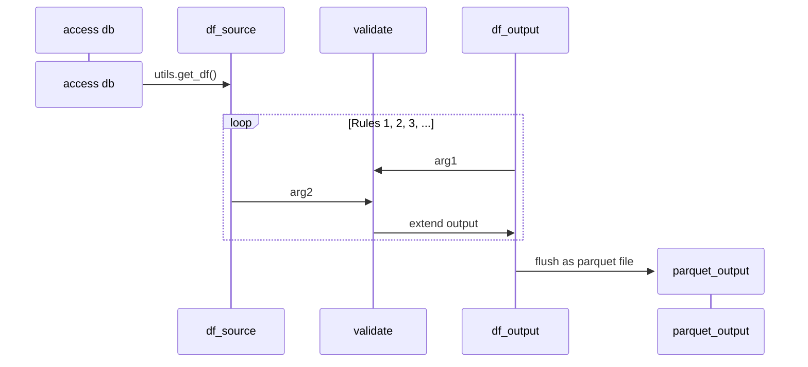
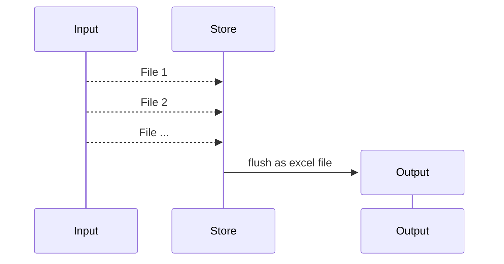

# Architecture

## Sequence for a single Access database file

```mermaid
sequenceDiagram
    participant access db

    participant df_source
    destroy access db
    access db->>df_source: utils.get_df()

    participant validate
    participant df_output

    loop Rules 1, 2, 3, ...
        df_output->>validate: arg1
        df_source ->> validate: arg2
        validate ->> df_output: extend output
    end

    create participant parquet_output
    df_output ->> parquet_output: flush as parquet file
```

## Input (Access) to Store (parquet) to Output (excel)

```mermaid
sequenceDiagram
    participant Input
    participant Store

    Input -->> Store: File 1
    Input -->> Store: File 2
    Input -->> Store: File ...

    create participant Output
    Store ->> Output: flush as excel file
```